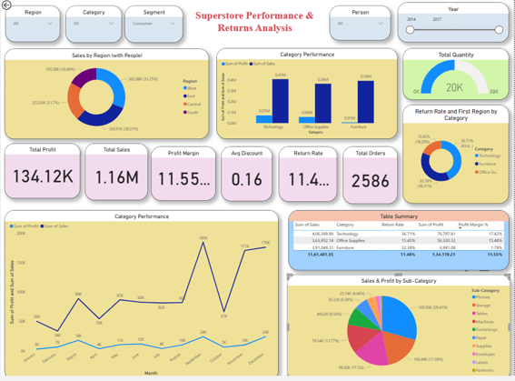

# 📊 Superstore Performance & Returns Analysis
## 📌 Project Overview
This project presents an interactive Power BI dashboard built using the Sample Superstore dataset. The dashboard analyzes business performance across sales, profit, orders, and product returns to uncover actionable insights that support strategic decision-making.

The dashboard enables stakeholders to monitor KPIs, identify high-performing regions and categories, and understand factors affecting profitability.
## 🎯 Business Objective
The objective of this project is to:

- Analyze sales and profitability.
- Identify high-performing regions.
- Monitor return rates.
- Track key performance indicators (KPIs) including sales, profit, orders, and average discount.
- Support better business decisions using data.

## 🛠️ Tools & Technologies Used

| Tool | Purpose |
|------|---------|
| Power BI | Data Visualization & Dashboard Creation |
| Microsoft Excel | Dataset Storage and Source |
| DAX | KPI Calculations and Measures |
| Power Query | Data Cleaning & Transformation | 

## 🧠 Skills Demonstrated

- Data Cleaning using Power Query
- Data Modeling
- DAX Measures & Calculations
- KPI Development
- Interactive Dashboard Design
- Business Data Analysis
- Data Visualization
- Data Storytelling

# 📂 Dataset

- Dataset: Sample Superstore
- Format: Excel (.xls)

# 📊 Dashboard Features

### KPI Cards

- Total Sales
- Total Profit
- Profit Margin
- Return Rate
- Average Discount
- Total Orders

### Interactive Filters

- Region
- Category
- Segment
- Person
- Year

### Visualizations

- Sales by Region
- Sales & Profit by Category
- Return Rate Analysis
- Monthly Sales Trend
- Sales & Profit by Sub-category
- Summary Table

## 📸 Dashboard Demo

The GIF below demonstrates the interactive features of the Power BI dashboard.

## 📷 Dashboard Screenshot

# 🔍 Key Insights

- Technology generates the highest profit.
- Furniture has lower profit margins because of higher discounts.
- The West region contributes the highest sales.
- High return rates reduce profitability in some regions.
- A few sub-categories generate most of the revenue.

# 💡 Business Recommendations

- Reduce excessive discounts.
- Improve logistics in high-return regions.
- Focus marketing on profitable categories.
- Increase investment in high-performing products.

## 📌 Conclusion

This dashboard provides an interactive view of Superstore sales, profitability, discounts, and returns. By combining key performance indicators with dynamic visualizations, it helps identify business trends, monitor performance, and support data-driven decision-making.

## 👤 Author

**Harsha Janardhanan**

Aspiring Data Analyst | Power BI | Excel | SQL | Python

- 🔗 **LinkedIn:** [Harsha Janardhanan](www.linkedin.com/in/harsha-janardhanan-3aa9a1298)
- 📧 **Email:** harshajanardhanan2@gmail.com

